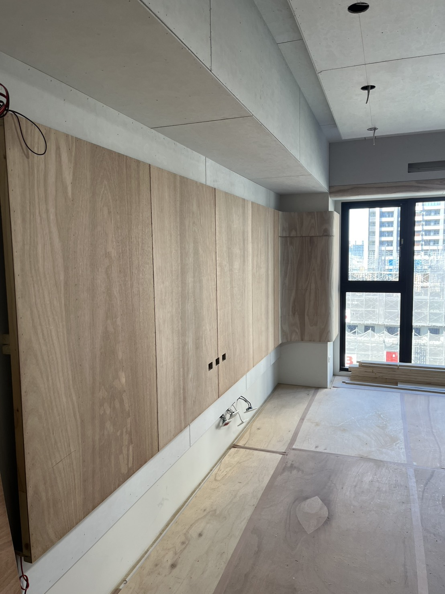

# Homepage Featured Cases Guide

這份說明專門講「如何更換首頁精選案例」。

目標檔案：`index.html`  
主要區塊：`<section id="portfolio"> ... </section>`

---

## 1) 精選案例卡片改哪裡

在 `index.html` 內，每張精選卡通常像這樣：

```html
<a href="cases/the-springs/index.html" class="relative overflow-hidden group block">
  
  ...
</a>
```

每張卡你主要改 4 個欄位：

- `href`：點擊後去的案例頁
- `img src`：卡片封面圖
- `alt`：圖片替代文字（SEO/無障礙）
- 文字內容：卡片內標題與副資訊

---

## 2) 這些欄位各自影響什麼

- `href="cases/<case-slug>/index.html"`
  - 控制點卡片後進入哪個案例詳情頁
- `img src="cases/<case-slug>/img/01.jpg"`
  - 控制首頁精選卡顯示哪張縮圖
- `alt="..."`
  - 搜尋引擎與讀屏器看的文字，建議寫完整案例名稱
- 卡片標題/副標
  - 前台使用者看到的案例資訊（建議和詳情頁一致）

---

## 3) 新增一張精選案例（最快方式）

1. 在 `#portfolio` 區塊複製一張現有 `<a ...>` 卡片
2. 改成新案例的：
   - `href`
   - `img src`
   - `alt`
   - 顯示文字
3. 存檔後重整首頁確認

---

## 4) 移除一張精選案例

直接刪掉該張卡的整段 `<a ...>...</a>`（或暫時註解）。  
若要保留版型數量，可把它替換成其他案例。

---

## 5) 常見問題與排除

### 問題 A：首頁精選縮圖破圖

檢查兩件事：

1. `img src` 路徑是否正確（大小寫、資料夾名稱）
2. 圖片檔是否真的存在  
   - 例如：`cases/<case-slug>/img/01.jpg`

### 問題 B：點卡片連到錯頁面

檢查 `href` 是否仍指向舊案例路徑。

### 問題 C：Navbar 的「精選案例」跑去總覽頁

應在 `shared/navbar.js` 保持：

```js
featured: root + "/index.html#portfolio",
overview: root + "/cases/index.html",
```

---

## 6) 建議維護規則

- 首頁精選只放 3~6 個「主推案例」
- 全部案例都放在 `cases/index.html`
- 每個案例資料夾都固定結構：
  - `cases/<case-slug>/index.html`
  - `cases/<case-slug>/img/01.jpg`

---

## 7) 發佈前最小檢查

- [ ] 首頁每張精選卡都顯示圖片
- [ ] 每張卡點擊都進對應詳情頁
- [ ] 手機版首頁精選卡仍正常排版
- [ ] 導覽列「精選案例 / 案例總覽」連結正確分流

